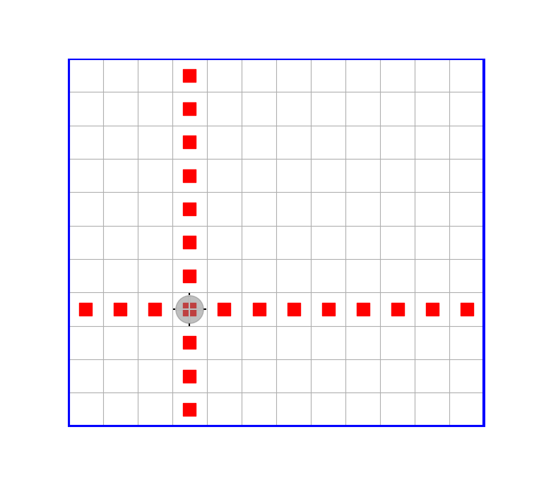

# ПРИМЕР ВЫПОЛНЕНИЯ ПРОГРАММЫ ДЛЯ РОБОТА

Пусть имеется функция, решающая с помощью Робота, следующую задачу.

**ДАНО:** Робот находится в произвольной клетке ограниченного прямоугольного поля без внутренних перегородок и маркеров.

**РЕЗУЛЬТАТ:** Робот — в исходном положении в центре прямого креста из маркеров, расставленных вплоть до внешней рамки.

Результат работы этой программы должен выглядеть примерно так .

Пусть исходный код программы находится в текущей папке в файле ["mark_kross.jl"](source_mark_kross.md), в котором имеется главная функция `mark_kross!(::Robot)`.

Тогда, чтобы исполнить эту функцию, можно будет выполнить, например, следующие действия в REPL.
```julia
    julia> using HorizonSideRobots
    julia> r=Robot(animate=true)
    julia> include("mark_kross.jl")
    julia> mark_kross!(r)
```

А если, например, исходная обстановка на поле была бы представлена в некотором файле, а результат мы хотели бы получить в другом файле,  пусть это будут, для определенности, файлы "infile.sit" и "outfile.sit", соответственно, то мы могли бы действовать так. 

Сначала нам понадобится написать еще одну функцию-обертку для функции mark_kross!. Эта наша функция-обертка даже будет иметь почти то же самое имя, нобез "!" на конце.

```julia 
    function mark_kross(infile_name::String, outfile_name::String)
        r=Robot(infile_name)
        mark_kross!(r)
        save(r, outfile_name)
    end
```    

Эту функцию, мы могли бы поместить, например, в тот же самый файл "mark_krest.jl". Но только при этом именно ее мы должны были бы считать главной функцией. Тогда для ее исполнения можно было бы в REPL выполнить, например, следующие действия.

```julia
    julia> using HorizonSideRobots
    julia> include("mark_kross.jl")
    julia> show("infile.sit")
    julia> mark_kross("infile.sit","outfile.sit")
    julia> show("outfile.sit")
```

При этом, чтобы подготовить файл "infile.sit" мы предварительно могли бы воспользоваться функцией `sitcreate`

```julia
    julia> sitcreate(11,12;newfile="infile.sit")

если потом понадобилось бы еще скорректировать файл "infile.sit", то следовало бы воспользоваться функцией `sitedit`

    julia> sitedit("infile.sit")

```
